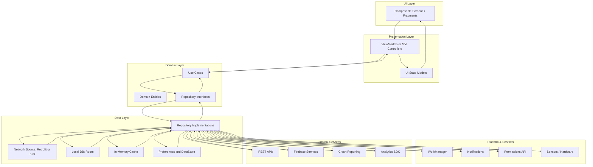

# Architecture Overview
[Back to README](./README.md) • This document is summarized in the README.

This document provides a high-level overview of the proposed architecture for the Android application contained in this repository. It follows a modular, clean architecture inspired layering to promote testability, separation of concerns, and scalability.

## Layers

- UI Layer (Compose / XML Views): Renders state and delegates user intents.
- Presentation Layer (ViewModel + UI State / MVI reducers): Coordinates UI logic, exposes immutable state, triggers use cases.
- Domain Layer (Use Cases + Entities + Repository Interfaces): Business rules, pure Kotlin, no Android framework dependencies.
- Data Layer (Repository Implementations + Data Sources): Orchestrates data from network, cache, database, and device services.
- Platform & Services: Android system services, permissions, notifications, WorkManager, etc.
- External Services: REST APIs, Firebase, Analytics, Crash Reporting.

## Mermaid Diagram

## Data Flow Summary

1. User interacts with UI components, generating events.
2. ViewModel (or MVI reducer) interprets events, invokes corresponding Use Case.
3. Use Case communicates with Repository Interface.
4. Repository Implementation selects appropriate data source strategy (cache-first, network-then-persist, etc.).
5. Data sources talk to external APIs, local storage, preferences, or platform services.
6. Results propagate upward: Repository → Use Case → ViewModel updates immutable state → UI re-composes.

## Error & State Handling

- Use sealed classes / Result wrappers for success, loading, and error.
- Map low-level errors to domain-friendly errors centrally.
- ViewModel exposes `StateFlow` / immutable UI state objects.

## Dependency Injection

Prefer Hilt (official) or Koin: inject repositories, use cases, platform abstractions.

## Testing Strategy

- Domain: Pure unit tests (no Android dependencies).
- Data: Repository tests with fake sources; network via MockWebServer; Room instrumented tests.
- Presentation: ViewModel coroutine tests (TestDispatcher + Turbine).
- UI: Compose tests (semantics), optional screenshot and accessibility checks.

## Next Steps

- Modularize (:app, :core:common, :domain, :data, :feature-xyz).
- Introduce version catalogs, explicit API boundaries.
- Add structured logging, performance metrics, crash + trace correlation.
- Consider feature flags & experiment framework.

---