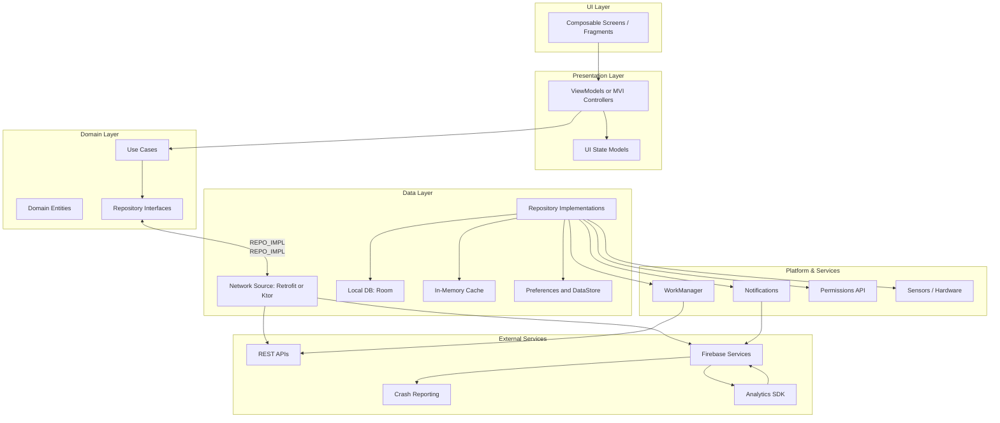

# Architecture Overview

[Back to README](./README.md) • This document is summarized in the README.

AllThingsAndroid follows modern Android development principles with clean architecture patterns. The application is structured in distinct layers to promote separation of concerns, testability, and maintainability.

## Architecture Diagram

## Layer Descriptions

### UI Layer
- **Composable Screens/Fragments**: Jetpack Compose UI components that render the user interface
- Responsible for displaying data and capturing user interactions

### Presentation Layer
- **ViewModels**: Manage UI-related data and handle business logic for specific screens
- **UI State Models**: Data classes representing the state of the UI
- Survives configuration changes and provides a clean separation between UI and business logic

### Domain Layer
- **Use Cases**: Encapsulate business rules and coordinate data from repositories
- **Domain Entities**: Business objects that represent core concepts of the application
- **Repository Interfaces**: Abstract contracts for data access, independent of implementation details

### Data Layer
- **Repository Implementations**: Concrete implementations of repository interfaces
- **Network Source**: HTTP clients (Retrofit/Ktor) for API communication
- **Local Database**: Room database for persistent local storage
- **In-Memory Cache**: Temporary data storage for performance optimization
- **Preferences**: SharedPreferences and DataStore for app settings and user preferences

### Platform Services
- **WorkManager**: Background task scheduling and execution
- **Notifications**: System notifications and notification channels
- **Permissions**: Runtime permission handling
- **Sensors/Hardware**: Access to device sensors and hardware features

### External Services
- **REST APIs**: Third-party web services and APIs
- **Firebase Services**: Authentication, analytics, crash reporting, and other Firebase features
- **Crash Reporting**: Error tracking and crash analytics
- **Analytics**: User behavior tracking and app performance metrics

## Key Architectural Principles

1. **Separation of Concerns**: Each layer has distinct responsibilities
2. **Dependency Inversion**: Higher layers depend on abstractions, not concrete implementations
3. **Unidirectional Data Flow**: Data flows down, events flow up
4. **Testability**: Architecture supports unit testing at every layer
5. **Scalability**: Modular structure allows for easy feature additions and modifications

## Technology Stack

- **UI**: 100% Jetpack Compose with Material Design 3
- **Language**: Kotlin
- **Architecture**: MVVM with Clean Architecture principles
- **Dependency Injection**: (Future enhancement - Hilt/Koin)
- **Asynchronous Programming**: Kotlin Coroutines and Flow
- **Navigation**: Jetpack Navigation Component for Compose
- **Local Storage**: Room database and DataStore
- **Network**: Retrofit for API communication
- **Testing**: JUnit, Mockk, Compose Testing framework