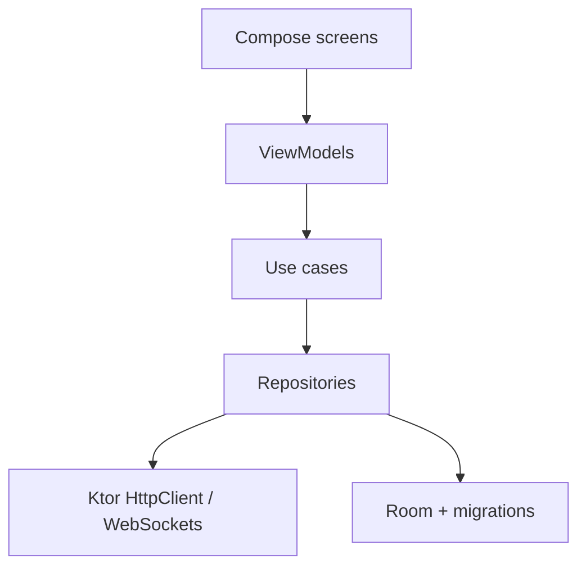

# Architecture

Layered clean architecture. DI is **Koin**. Network is **Ktor**. No Hilt. No Retrofit.

## Layers

- **UI** — Compose screens, immutable state, user intents.
- **Presentation** — ViewModels expose `StateFlow`.
- **Domain** — Pure Kotlin use cases (`:core:domain`).
- **Data** — Repositories, Room (`:core:database`), Ktor (`:core:network`).
- **App** — Nav host, Koin graph, flavors `demo` / `live`.

```mermaid
flowchart TB
  UI[Compose screens] --> VM[ViewModels]
  VM --> UC[Use cases]
  UC --> REPO[Repositories]
  REPO --> Ktor[Ktor HttpClient / WebSockets]
  REPO --> Room[Room + migrations]
```

## Koin

- `appModule`, `viewModelsModule`, `networkModule`, `persistenceModule` — existing app.
- `portfolioModule` — catalog + product features, `AppDispatchers`, `VoiceTransport`, shared `HttpClient`.

## Room

`PortfolioDatabase` version **3**, `exportSchema = true`, schemas under `core/database/schemas/`.

- v1 → v2: `MIGRATION_1_2` (pinned column)
- v2 → v3: `MIGRATION_2_3` (headline rename + `updated_at`)

## Navigation

Existing Channel + `AppNavigator` + feature destinations. New product routes live in `PortfolioFeature`. Navigation 3 skill is vendored for the next host migration.

## Flavors

| Flavor | Backend |
| --- | --- |
| `demo` | Fakes / local echo. Runs without keys. |
| `live` | Real Maps / Firebase when `local.properties` + Play config exist. |

## Testing

- JUnit 5 + MockK on JVM modules and feature ViewModels.
- Compose UI tests with `testTag` on each new screen.
- JaCoCo gate on `:core:domain` (90%).
- CI: unit tests + `lintDemoDebug` + `assembleDemoDebug`.
