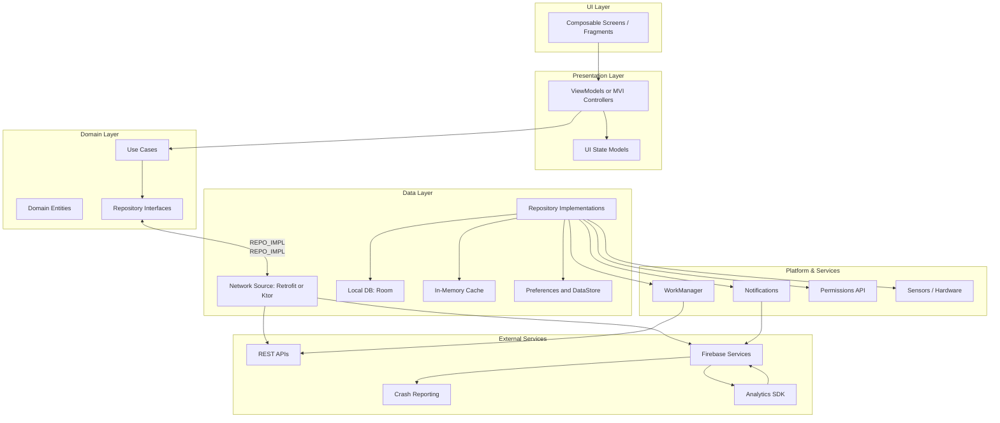

## AllThingsAndroid

AllThingsAndroid is an Android application built with Jetpack Compose, showcasing modern UI patterns, navigation, and example implementations for discussion and learning. Some examples are intentionally less formal to invite architectural debate; most others follow clean practices with unit and instrumented tests.

> Full architecture document: see [ARCHITECTURE.md](./ARCHITECTURE.md)

---

## Table of Contents
- [Key Highlights](#key-highlights)
- [Architecture Overview (Summary)](#architecture-overview-summary)
- [Architecture Diagram](#architecture-diagram)
- [Features Implemented](#features-implemented)
- [Core Technologies & Architecture](#core-technologies--architecture)
- [Project Structure Overview](#project-structure-overview)
- [Getting Started](#getting-started)
  - [Prerequisites](#prerequisites)
  - [Clone](#clone)
  - [Open & Run](#open--run)
  - [Optional Developer Notes](#optional-developer-notes)
- [Potential Future Enhancements](#potential-future-enhancements)
- [General Screens](#general-screens)
- [Calculator Instrumented Tests Demo](#calculator-instrumented-tests-demo)
- [Acknowledgements](#acknowledgements)
- [Author](#author)

---

## Key Highlights
- 100% Jetpack Compose UI (Material 3)
- Navigation decoupled via intent/channel pattern
- Multiple feature/demo screens for experimentation
- Progressive clean architecture layering (UI / Presentation / Domain / Data)
- Designed as a living reference and discussion catalyst

---

## Architecture Overview (Summary)

This project adopts a layered architecture:

- UI Layer: Composables render state & emit user intents.
- Presentation Layer: ViewModels (potential MVI reducers) expose immutable state (e.g. `StateFlow`).
- Domain Layer: Use Cases, Entities, Repository interfaces (pure Kotlin, framework-free).
- Data Layer: Repository implementations orchestrate cache, persistence, network.
- Platform & Services: WorkManager, permissions, notifications, sensors, etc.
- External Services: REST APIs, Firebase, analytics, crash reporting.

High-level flow:
User → UI → ViewModel → Use Case → Repository → Data Sources (network/db/cache/platform) → back up → ViewModel updates state → UI recomposes.

For the detailed rationale, testing strategy, and data flow narrative see the full [ARCHITECTURE.md](./ARCHITECTURE.md).

---

## Architecture Diagram



---

## Features Implemented

The application includes the following distinct features and UI showcases:

* **Home:** Main landing screen.
* **Profile:** Displays user-specific information (navigable with a `userId`).
* **Settings:** Application settings screen.
* **Download:** Demonstrates file download capabilities.
* **Buttons Showcase:** (`ButtonScreen` from `commonscreens`) Various button styles and interactions.
* **Lists Showcase:** (`ListsScreen` from `commonscreens`) List implementations in Compose.
* **Login Examples:**
  * `LoginScreen`
  * `LoginScreenFake` (alternative example)
* **Text Fields Showcase:** (`AllTextFieldsScreen`) Assorted text input implementations.
* **API Showcase (JSONPlaceholder):** (`ApiShowcaseScreen`) Fetching & displaying remote data.
* **Meditation UI:** (`HomeMeditation`) Stylized presentation example.

---

## Core Technologies & Architecture

* **UI:** Jetpack Compose (Material 3)
* **Language:** Kotlin
* **Navigation:** Jetpack Navigation for Compose
  * Central graph in `NavigationGraph.kt`
  * Navigation intents via `Channel<NavigationIntent>` processed in `MainViewModel`
  * Feature route abstractions (e.g. `HomeFeature`, `ProfileFeature`)
* **State Management:** `ViewModel` + Coroutines + `Flow`
* **Async:** Structured concurrency with coroutines
* **Reusability:** Shared composables/screens in `commonscreens`
* **Architecture Direction:** Moving toward fuller separation (Domain/Data modularization next)

---

## Project Structure Overview

```
app/
  src/main/java/com/arthurabreu/allthingsandroid/
    core/navigation/
      NavigationGraph.kt
      NavigationIntent.kt
      destinations/
        ApiShowcaseFeature.kt
        ButtonsFeature.kt
        ...
    ui/screen/
      ApiShowcaseScreen.kt
      DownloadScreen.kt
      ProfileScreen.kt
      ...
    ui/viewmodel/main/
      MainViewModel.kt
commonscreens/
  ButtonScreen.kt
  ListsScreen.kt
  LoginScreenFake.kt
  ...
```

---

## Getting Started

### Prerequisites
* Android Studio (Giraffe or newer recommended)
* Correct Android SDK versions (see Gradle configuration)
* Git
* JDK 17 (adjust if project build scripts specify otherwise)

### Clone

```bash
git clone https://github.com/arthurabreu/AllThingsAndroid.git
cd AllThingsAndroid
```

### Open & Run
1. Open the project in Android Studio.
2. Let Gradle sync finish.
3. Select an emulator or physical device.
4. Run the `app` configuration.

### Optional Developer Notes
- If adding DI later (Hilt/Koin), keep module boundaries clean.
- Consider adding a `:domain` and `:data` module when refactoring architecture.
- Use feature flags for experimental screens once growth accelerates.

---

## Potential Future Enhancements

* **Expanded Unit Tests:** Greater ViewModel & domain coverage.
* **UI Tests:** Richer Compose interaction testing.
* **Dependency Injection:** Introduce Hilt or Koin.
* **Persistence:** Room for offline caching / metadata.
* **Error Handling:** Central domain error mapping + user messaging layer.
* **Advanced Theming:** Dynamic color & typography refinements.
* **Accessibility:** TalkBack audits, focus order, larger font testing.
* **CI/CD:** GitHub Actions for build, lint, tests.
* **Performance Metrics:** Startup time, recomposition counts, tracing.
* **Feature Flags:** Gradual rollout & experimentation frameworks.

---

## General Screens


---

## Calculator Instrumented Tests Demo
[](https://www.youtube.com/watch?v=ZUHIOGA8iao)

---

## Acknowledgements

* [Android Developer Documentation](https://developer.android.com/)
* [Jetpack Compose Documentation](https://developer.android.com/jetpack/compose)
* [JSONPlaceholder API](https://jsonplaceholder.typicode.com/) (demo data)
* Community libraries & articles supporting best practices

---

## Author

**Arthur Abreu / Senior Android Developer**  
**Project Link:** [AllThingsAndroid Repository](https://github.com/arthurabreu/AllThingsAndroid)

---
