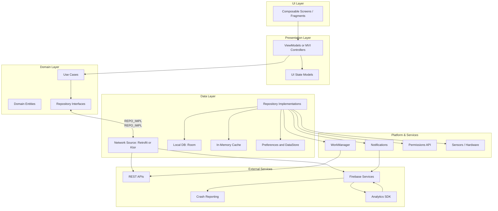

# AllThingsAndroid

AllThingsAndroid is an Android application built with Jetpack Compose, designed to showcase a variety of common UI patterns, modern Android development best practices using Jetpack libraries, and distinct feature implementations. It serves as a practical reference for building contemporary Android apps.

Some cases don't have clean architecture and the best patterns, as they can be used to discuss the best approach. Most other examples are coded clean, with unit tests and instrumented tests.

Only Meditation UI had a design that was thought as a showcase, the rest is mostly to showcase code.

📖 **[Complete Architecture Documentation](./ARCHITECTURE.md)**

## Table of Contents

- [Architecture Overview (Summary)](#architecture-overview-summary)
- [Architecture Diagram](#architecture-diagram)
- [Features Implemented](#features-implemented)
- [Core Technologies & Architecture](#core-technologies--architecture)
- [Project Structure Overview](#project-structure-overview)
- [Getting Started](#getting-started)
- [Potential Future Enhancements](#potential-future-enhancements)
- [Screenshots](#screenshots)
- [Acknowledgements](#acknowledgements)

## Architecture Overview (Summary)

AllThingsAndroid follows **Clean Architecture** principles with clear separation of concerns across multiple layers:

- **UI Layer**: 100% Jetpack Compose screens and components
- **Presentation Layer**: ViewModels managing UI state and business logic
- **Domain Layer**: Use cases, entities, and repository interfaces
- **Data Layer**: Repository implementations, network sources, local database, and caching
- **Platform Services**: WorkManager, notifications, permissions, and sensor access
- **External Services**: REST APIs, Firebase integration, analytics, and crash reporting

The architecture promotes **testability**, **maintainability**, and **scalability** while leveraging modern Android development tools and patterns. Navigation is handled through Jetpack Navigation Component with centralized route management and decoupled navigation commands.

For detailed architectural information, see the [complete Architecture Documentation](./ARCHITECTURE.md).

## Architecture Diagram



## Features Implemented

The application includes the following distinct features and UI showcases:

*   **Home:** The main landing screen of the application.
*   **Profile:** Displays user-specific information, navigable with a `userId`.
*   **Settings:** Provides a screen for application settings.
*   **Download:** A section demonstrating file download capabilities.
*   **Buttons Showcase:** (`ButtonScreen` from `commonscreens`) Exhibits various button styles and interactions.
*   **Lists Showcase:** (`ListsScreen` from `commonscreens`) Demonstrates different list implementations in Compose.
*   **Login Examples:**
    *   `LoginScreen`: A primary login interface.
    *   `LoginScreenFake`: (`LoginScreenFake` from `commonscreens`) An alternative or example login UI.
*   **Text Fields Showcase:** (`AllTextFieldsScreen` from `commonscreens`) Shows diverse text input field implementations.
*   **API Showcase (JSONPlaceholder):** (`ApiShowcaseScreen`) Features fetching and displaying data from the JSONPlaceholder API.
*   **Meditation UI:** (`HomeMeditation`) A user interface designed for a meditation or mindfulness feature.

## Core Technologies & Architecture

*   **UI:** 100% Jetpack Compose using Material Design 3 components.
*   **Language:** Kotlin
*   **Navigation:** Jetpack Navigation Component for Compose.
    *   Centralized graph definition in `NavigationGraph.kt`.
    *   Navigation commands are decoupled via a `Channel<NavigationIntent>` in `MainViewModel`, observed by `NavigationEffects` to drive the `NavController`.
    *   Feature-based route definitions (e.g., `HomeFeature`, `ProfileFeature`) for clarity.
*   **State Management:** Android `ViewModel` for UI state and business logic.
*   **Asynchrony:** Kotlin Coroutines and `Flow` for managing background tasks and data streams (evident in navigation effects).
*   **Modularization (Inferred):** The use of `com.arthurabreu.commonscreens` suggests common UI components or screens might be in a separate module for reusability.

## Project Structure Overview

*   `app/src/main/java/com/arthurabreu/allthingsandroid/`:
    *   `core/navigation/`:
        *   `NavigationGraph.kt`: Defines the `NavHost` and all composable destinations.
        *   `NavigationIntent.kt`: Sealed class for navigation actions.
        *   `destinations/`: Sealed interfaces defining routes for each feature (e.g., `ApiShowcaseFeature.kt`, `ButtonsFeature.kt`).
    *   `ui/screen/`: Contains the composable functions for each specific screen of the app (e.g., `ApiShowcaseScreen.kt`, `DownloadScreen.kt`, `ProfileScreen.kt`).
    *   `ui/viewmodel/main/MainViewModel.kt`: Application-level ViewModel, likely managing navigation events through `navigationChannel`.
*   `commonscreens/` (Package prefix: `com.arthurabreu.commonscreens`): Appears to host reusable UI screens like `ButtonScreen`, `ListsScreen`, etc.

## Getting Started

### Prerequisites

*   Android Studio (Recommended: Arctic Fox | 2020.3.1 or newer to support Jetpack Compose features used)
*   Android SDK (Compile SDK and Target SDK as defined in the project's `build.gradle`)
*   Git

### Setup and Run

1.  **Clone the repository:**
    ```bash
    git clone https://github.com/arthurabreu/AllThingsAndroid.git
    cd AllThingsAndroid
    ```

2.  **Open in Android Studio:**
    - Launch Android Studio
    - Open the project folder
    - Wait for Gradle sync to complete

3.  **Build and Run:**
    - Select a target device or emulator
    - Click "Run" or use `Ctrl+F5` (Windows/Linux) / `Cmd+R` (Mac)

## Potential Future Enhancements

*   **Unit Tests:** Expanding unit test coverage for ViewModels and business logic.
*   **UI Tests:** Adding more comprehensive Jetpack Compose UI tests for each screen to verify interactions and state changes.
*   **Dependency Injection:** Implementing Hilt or Koin for robust dependency management.
*   **Data Persistence:** Incorporating Room database for local data storage where applicable (e.g., user preferences in Settings, downloaded file metadata).
*   **Error Handling:** More sophisticated error handling and display mechanisms, especially for API calls.
*   **Theming:** Advanced theming options, including dark mode support if not already fully implemented.
*   **Accessibility:** Enhancing accessibility features (e.g., content descriptions, focus order).
*   **CI/CD:** Setting up Continuous Integration/Continuous Deployment pipelines.


## Screenshots

## General Screens


## Calculator Instrumented Tests Demo
[](https://www.youtube.com/watch?v=ZUHIOGA8iao)

## Acknowledgements

*   Android Developer Documentation ([https://developer.android.com/](https://developer.android.com/))
*   Jetpack Compose Documentation ([https://developer.android.com/jetpack/compose](https://developer.android.com/jetpack/compose))
*   JSONPlaceholder API ([https://jsonplaceholder.typicode.com/](https://jsonplaceholder.typicode.com/)) for demo API data.
*   [Any other libraries, articles, or individuals you'd like to credit]

---

**Author:** [Arthur Abreu/Senior Android Developer]
**Project Link:** [https://github.com/arthurabreu/AllThingsAndroid.git](https://github.com/arthur_abreu/AllThingsAndroid.git)

    
